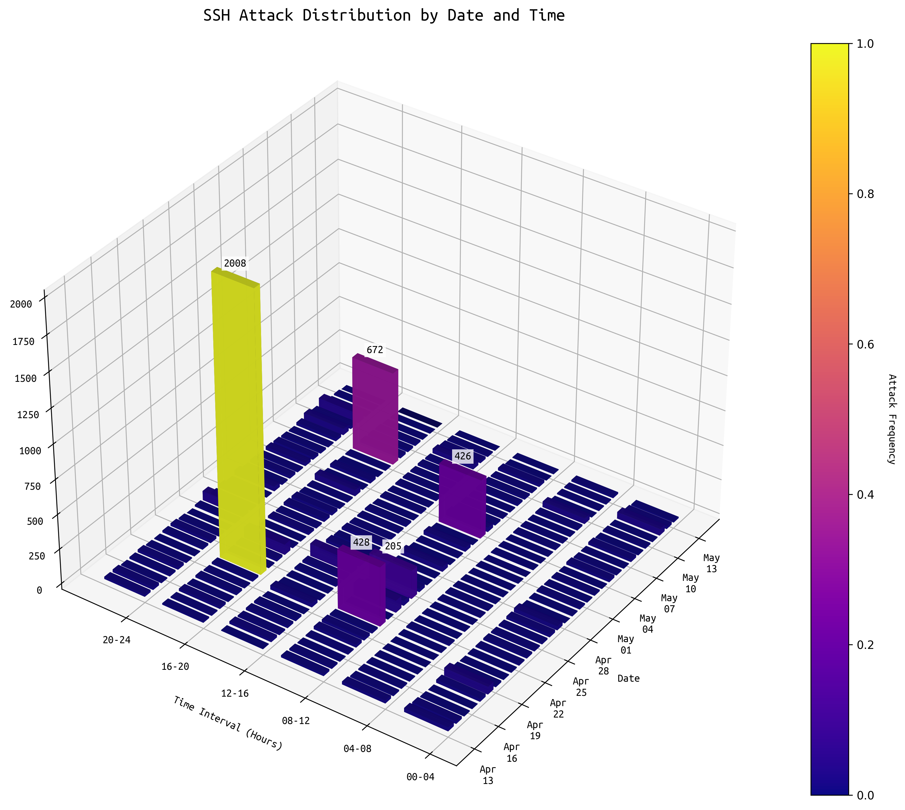

# Anti-SSH-Attack 分析一波现实中的 SSH 爆破攻击

基于自己部署在阿里云的ECS中提取出的 `auth.log*` 日志进行分析。

## 目录结构

```bash
.
+---archive # 存放 auth.log* 的目录
+---font    # 词云字体文件
+---img     # 词云图片 
+---result  # 存放经过清洗筛选的文件 *.csv
+---source  # 存放解压过的 auth.log.*.gz 文件
+---src     # 源码
\---target  # 存放初次清洗过的文件 *.txt
```

## 运行环境

- [x] Debian/Ubuntu 目标服务器 *RHEL/SUSE没试过*
- [x] 自带/能装的了SSH服务和Python3环境的本地设备
- [ ] [Anaconda3](https://www.anaconda.com/download/success) *非必须，只是我用着舒服*

## 运行步骤

1. 本地设备拉取远端的 `auth.log*` 日志

    ```bash
    scp <username>@<target ip>:/var/log/auth.* ./archive
    ```

    如果有些日志因为时间久远归档了，可以先解压再拉取：

    ```bash
    gzip -d auth.log.*.gz
    scp <username>@<target ip>:/var/log/auth.log.* ./source
    ```

2. 创建 Python venv 环境

    ```bash
    conda create --name anti-attack python=3.12.7
    ```

3. 安装依赖

    ```bash
    python -m pip install pandas wordcloud matplotlib
    ```

4. 按序号执行 `src` 目录下的 Python 脚本

    ```bash
    +---src
    |       1.clean.py                  # 清洗
    |       2.accepted.py               # 统计成功登录的记录
    |       3.deny.py                   # 统计拒绝登录的记录
    |       4.analysis.py               # 统计字典爆破登录失败的记录
    |       5.others.py                 # 清洗除字典爆破以外登录失败的记录
    |       6.other_result.py           # 统计除字典爆破以外登录失败的记录
    |       7.final.py                  # 最终结果 按攻击时间递增排序
    |       8.wordcloud_ip.py           # 攻击方IP 词云
    |       9.wordcloud_username.py     # 字典爆破 用户名词云
    |       10.find_source.py           # 查找源IP
    |       11.wordcloud_source.py      # 源IP 词云
    |       12.datetime_audit.py        # 基于日期时间的统计
    |       anti_attack.sh              # /etc/hosts.deny 规则
    ```

    `anti_attack.sh` 这个脚本是用来将攻击方IP添加到 `/etc/hosts.deny` 中的，使用时需要 `sudo` 权限。脚本使用方式参见[此处](http://icing.fun/2025/05/12/server_maintain/#title2)。

## 前言

此次分析时间范围从2025年4月13日到2025年5月13日。分析样本来自自己部署在**阿里云**（注意这个，这个后面要考的）的ECS中提取出的 `auth.log*` 用户日志（`auth.log`, `auth.log.1`, `auth.log.2.gz`, `auth.log.3.gz`, `auth.log.4.gz` 共五份用户日志）。操作系统为 Ubuntu 20.04.2 LTS。

首先已经排除诸如 `CRON[PID]: pam_unix(cron:session): session opened for user root by (uid=0)` 这类的系统日志。然后对 `auth.log*` 日志进行清洗，筛选出 SSH 登录相关的日志。最后对登录失败的记录进行分析，统计出攻击方IP、用户名、时间等信息。
并根据审计报告中提到的攻击方行为“特别地”编写脚本进行主动阻止登录错误的IP地址的访问。

> 用户日志：保留成功或失败登录和身份验证过程的身份验证日志。存储取决于系统类型。对于 Debian/Ubuntu，请查看 /var/log/auth.log。对于 Redhat/CentOS，请转到 /var/log/secure。

### 知识

SSH（Secure Shell，安全外壳）是一种网络安全协议，通过加密和认证机制实现安全的访问和文件传输等业务。传统远程登录和文件传输方式，例如Telnet、FTP，使用明文传输数据，存在很多的安全隐患。随着人们对网络安全的重视，这些方式已经慢慢不被接受。SSH协议通过对网络数据进行加密和验证，在不安全的网络环境中提供了安全的网络服务。作为Telnet和其他不安全远程shell协议的安全替代方案，目前SSH协议已经被全世界广泛使用，大多数设备都支持SSH功能。默认情况下，SSH服务器使用端口号22。[^1]

SSH 攻击有多种类型：SSH 端口扫描、SSH 暴力攻击、使用受损 SSH 服务器的攻击。使用受感染服务器的攻击可能是 DoS 攻击、网络钓鱼攻击、垃圾邮件等。本文质疑来自受感染的 SSH 服务器的攻击是否与使用网络流的其他攻击隔离开来。在这项工作中，我们将 SSH 攻击分为两种类型。第一类包括 SSH 服务器成功入侵后的所有攻击活动。我们将其命名为“严重”攻击。第二种类型包括导致成功入侵的所有攻击。它包括 SSH 端口扫描、SSH 暴力攻击和没有活动的受损 SSH 服务器。第二类被命名为“不太严重”的攻击。[^2]

### 日志审计报告

#### 一、攻击事件概述

本报告针对近期收集的SSH访问日志进行详细的安全审计分析，以识别并评估服务器所面临的攻击风险。经分析发现，攻击行为主要包括以下几种类型：

**攻击类型统计**

1. 字典攻击/暴力攻击（Dictionary Attack/Brute-force Attack）：记录4,739次，是本次审计中最频繁和最具威胁性的攻击类型。

2. 连接关闭（Connection Closed）：发生1,098次，可能反映攻击者主动中断连接或防护系统主动拦截。

3. 横幅信息含非法字符（Banner Line Contains Invalid Characters）：发生213次，表明攻击者可能尝试利用特殊字符破坏服务器交互机制。

4. 客户端发送无效协议标识符（Client Sent Invalid Protocol Identifier）：160次，可能代表攻击者尝试探测服务器安全机制或进行协议混淆攻击。

5. 连接重置（Connection Reset）：57次，这通常意味着网络层次的干扰或防护系统的响应措施。

6. DH GEX密钥交换组范围异常（DH GEX Group Out of Range）：36次，攻击者可能尝试利用特定的密钥交换漏洞。

上述数据明确表明，字典攻击构成了此次审计中最主要的威胁。攻击者利用自动化工具系统性地尝试常见或弱密码，以获得SSH服务器未授权的访问权限。

#### 二、攻击来源地理分析

经地理信息追踪与分析，攻击源主要集中在以下地区和组织：

**主要攻击来源**

1. 中国杭州，阿里巴巴广告有限公司：2,002次，占攻击总量最高。（没想到啊没想到，你阿里这浓眉大眼的家伙，也叛变了）

2. 日本大阪，Dream Cloud Limited：636次，排名第二。

3. 中国四川成都，中国联通四川分公司：421次。 （这个估计是个脚本小子，拿家宽还是校园网在玩渗透也是很离谱了）

4. 中国福建厦门，中国移动：416次。 （这个估计也是个脚本小子）

5. 香港九龙，UCLOUD Information Technology：281次。


*捏🐎🐎的一个小水管一个月时间能被攻🐓6000+？四月二十日晚上四个小时就被攻🐓2008次也是很离谱了*

上述结果揭示攻击活动明显集中在亚太地区，尤其是中国大陆地区。这种地域集中性可能与区域内宽松的网络管理、成熟的云服务基础设施以及匿名化工具的广泛应用有关。

此处提供完整 [Treemap](https://icingtomato.github.io/Anti-SSH-Attack/)，可以清晰看到IP地址和源地址以及攻击手段。

*(下面都是废话)*

#### 三、风险评估与潜在影响分析

综合审计数据分析，字典攻击为SSH服务面临的主要安全威胁。攻击活动的高频率和持续性不仅严重占用系统资源、降低服务器性能，也大幅提升了被成功入侵的风险。此外，连接异常、协议混淆及密钥交换漏洞的利用显示攻击者拥有一定的技术能力与明确的攻击意图。

持续暴露在上述攻击环境下的服务器，可能遭受系统稳定性下降、敏感数据泄露以及关键服务中断的风险。此外，某些高频攻击源可能正在持续探测目标，试图寻找服务器安全薄弱点。

#### 四、安全防护策略与实施建议

针对以上审计分析结果和风险评估，本报告提出以下全面且具体的安全防护策略建议：

##### 访问控制与管理

- 严格控制SSH访问权限，配置防火墙规则限制可访问服务器的IP地址，尤其对高风险区域进行强化防护。

##### 安全工具自动化与优化

- 部署fail2ban、DenyHosts或SSHGuard等自动化防护工具，以动态阻断频繁的登录尝试，增强对自动化攻击的防御能力。
    （我懒得配置，1C512M小水管还整这么多花花肠子，真有能耐把SSH干碎了那估计全世界服务器天都塌了，也就配置SSH服务的登录失败次数限制，超过设定次数后自动锁定IP地址。代码参见此处[anti_attack.sh](https://github.com/IcingTomato/Anti-SSH-Attack/blob/master/src/anti_attack.sh)。）

##### 账户管理与身份认证强化

- 制定并执行严格的密码管理策略，定期审计密码强度，强制用户定期更换密码。推荐全面实施SSH密钥认证，取代传统用户名与密码认证方式。

##### 监控与预警体系

- 建立实时安全监控系统，及时识别并告警异常登录行为，使管理员能够快速响应和处理潜在威胁。

##### 持续安全审计与漏洞管理

- 定期开展安全审计与渗透测试，主动发现并及时修复可能的安全漏洞，持续强化服务器的防护能力。

##### 事件响应与业务连续性规划

- 制定明确的安全事件响应计划与业务连续性预案，确保在安全事件发生时能够迅速高效地进行响应和恢复，最大限度降低损失。

#### 五、审计结论与未来工作展望

本次SSH攻击日志审计结果明确指出服务器暴露于显著的暴力破解攻击风险中。这种威胁具有持续性、自动化和规模化的特征，亟需通过上述综合性的安全策略予以防范。此外，建议未来加强持续的安全数据分析，定期更新防护措施，以应对不断演化的网络安全威胁，确保服务器的长期安全稳定运行。

### 引用

[^1]: [什么是SSH？——华为IP知识百科](https://info.support.huawei.com/info-finder/encyclopedia/zh/SSH.html)
[^2]: [Classification of SSH Attacks Using Machine Learning Algorithms - IEEE Xplore](https://ieeexplore.ieee.org/document/7740316)